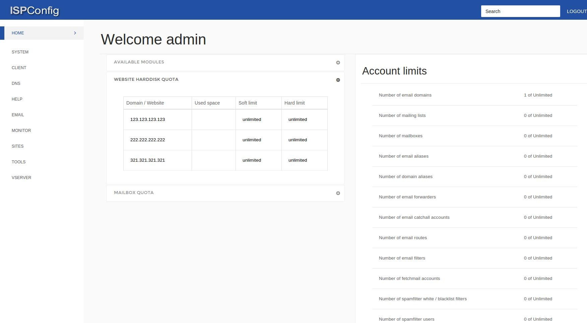
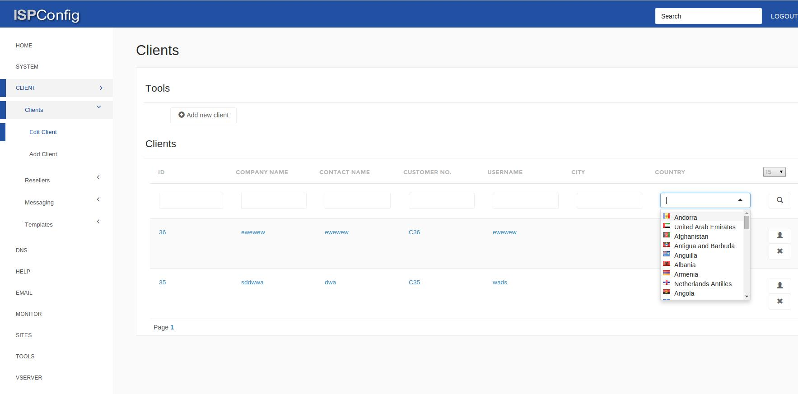
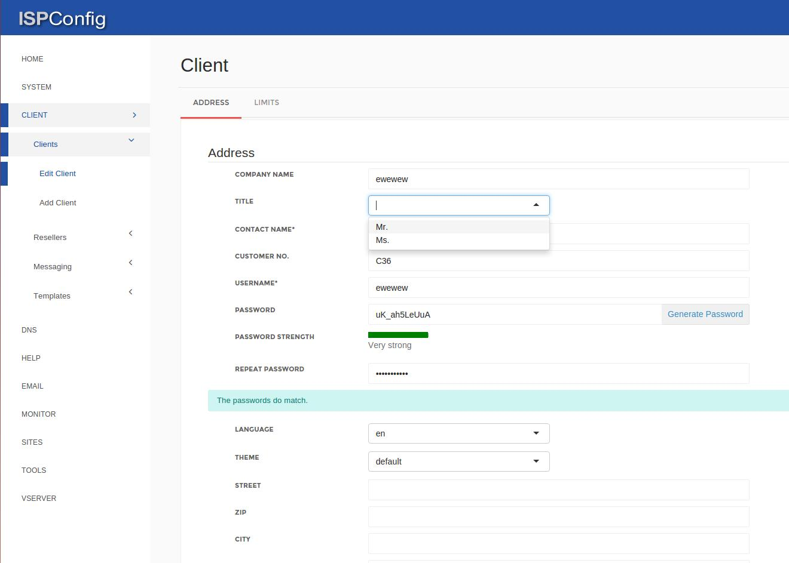
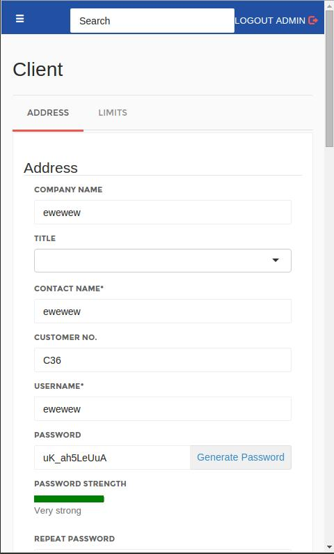

# NOPINK 

NoPink is a Bootstrap 3 and Pages based theme for ISPConfig 3.

* Bootstrap 3: http://getbootstrap.com/
* Pages: http://pages.revox.io/
* ISPConfig 3: http://www.ispconfig.org/

## Installation

* IMPORTANT NOTE - It is advised to make copies of the files listed below before replacing them, to be able return to the original theme if necessary.

* Replace the web folder (ISPConfig/interface/web) for this web folder.
* Replace the tform.inc.php file (ISPConfig/interface/lib/classes/tform.inc.php) for the one provided here.
* All done.

* To return to the original theme just replace the files for the originals.

## Changelog

* Fixed bugged strength meter.
* Fixed multiple design faults.
* Added mobile support.
* Blue and Default design are the same now.
* Small update on language files.

Tested with ISPConfig version 3.0.5.4p8.
Any bugs found should be reported if possible.
Comments and suggestions for improvements are most welcome.

## Screenshots

* Home Page

* Clients Table

* Edit Client Page

* Mobile

## About the Author

GitHub Username: apmarques
Note: This theme was a project for my first internship as a Web-Programmer.
